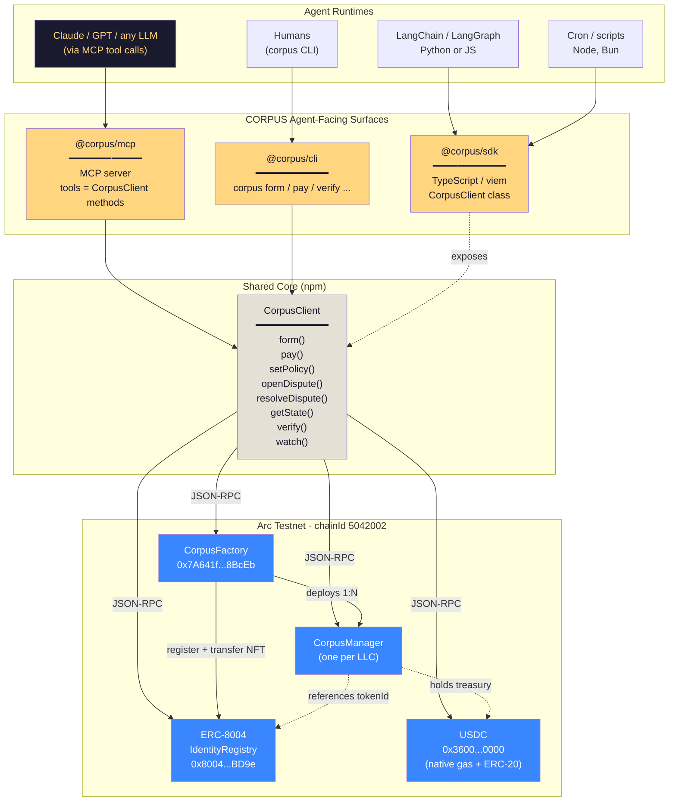
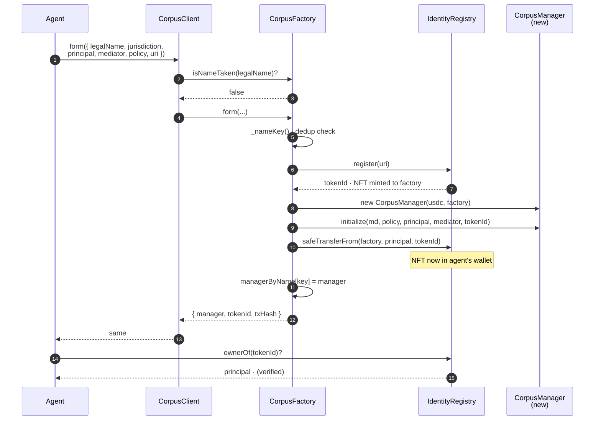
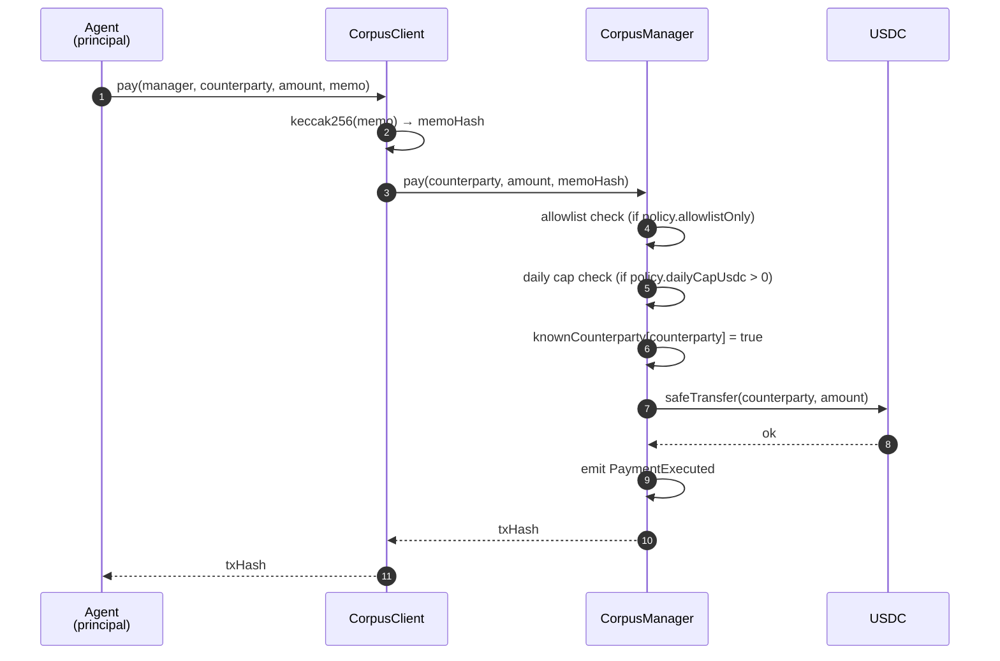
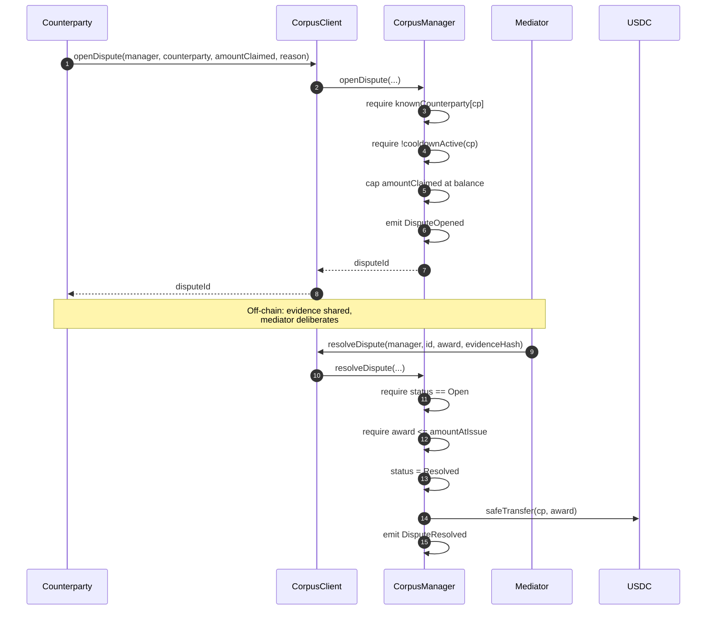
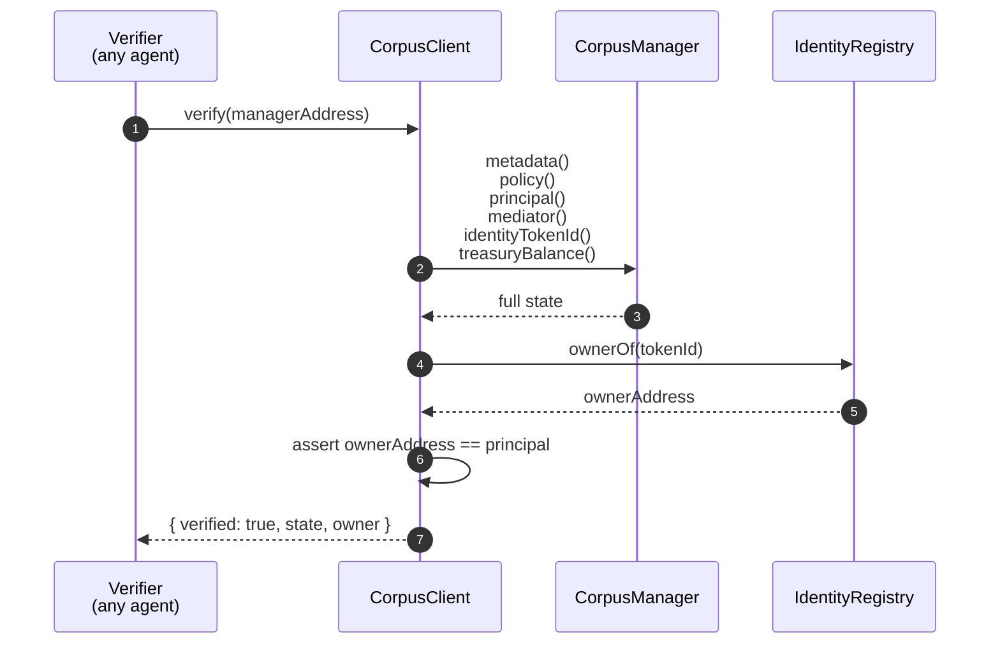

# CORPUS — System Architecture

> Visual spec for the agent-integration surface. Validate the logic here before any code is written. **No mocks. All flows hit real Arc Testnet contracts.**

---

## 1 · Component Map



---

## 2 · Formation Sequence (one agent forms an LLC)



---

## 3 · Payment Flow (LLC pays a counterparty)



---

## 4 · Dispute Lifecycle



---

## 5 · Verification (any third party verifies an entity)



---

## 6 · Surfaces · What Each One Does

### `@corpus/sdk` (TypeScript)

Already exists. Will be expanded to:

| Method | Purpose |
|---|---|
| `isNameTaken(name)` | Pre-flight name dedup check |
| `form(params)` | One-call formation → manager + tokenId + NFT to principal |
| `pay(manager, to, amount, memo)` | Spend treasury USDC under policy |
| `setAllowlist(manager, addr, allowed)` | Toggle counterparty allowlist entry |
| `setPolicy(manager, policy)` | Update daily cap / allowlistOnly |
| `rotatePrincipal(manager, next)` | Transfer commercial control (NFT also moves) |
| `rotateMediator(manager, next)` | Swap dispute arbiter |
| `openDispute(manager, cp, amount, reason)` | Counterparty or principal opens claim |
| `resolveDispute(manager, id, award, evidence)` | Mediator-only binding resolution |
| `treasuryBalance(manager)` | Read USDC balance |
| `usdcBalanceOf(addr)` | Read any address's USDC balance |
| `getEntityState(manager)` | Bundle: metadata + policy + actors + balance + tokenId |
| `verifyEntity(manager)` | Cryptographic verification: `ownerOf(tokenId) == principal` |
| `watchPayments(manager, cb)` | Subscribe to `PaymentExecuted` |
| `watchDisputes(manager, cb)` | Subscribe to `DisputeOpened` + `DisputeResolved` |
| `findEntityByName(name)` | Resolve manager address from legal name |

### `@corpus/cli` (Node binary · `npx corpus …`)

Thin wrapper over `@corpus/sdk`. Reads from env:

```
ARC_RPC_URL=…
CORPUS_FACTORY=0x7A641f73B87CA0b0fE4558a29565c55bE2C8BcEb
AGENT_PRIVATE_KEY=0x…
```

Commands:

```
corpus form     --name "Loom Trading DAO LLC" \
                --jurisdiction WY \
                --principal 0x… \
                --mediator 0x… \
                --daily-cap 1000 \
                --uri ipfs://… \
                --articles-hash 0x… \
                --oa-hash 0x…

corpus name-check "Loom Trading DAO LLC"

corpus state    <manager>           # full entity state, formatted
corpus verify   <manager>           # ownerOf(tokenId) == principal?

corpus pay      <manager> <to> <amount-usdc> --memo "…"
corpus allowlist <manager> <addr> [--remove]
corpus policy   <manager> --cap <usdc> [--allowlist-only]
corpus rotate-principal <manager> <next>
corpus rotate-mediator  <manager> <next>

corpus dispute open    <manager> <cp> <amount> "<reason>"
corpus dispute resolve <manager> <id> <award> <evidence-hash>

corpus watch    <manager>           # tail events
corpus find     "<legal name>"      # resolve manager from name
```

### `@corpus/mcp` (MCP server for LLM agents)

stdio MCP server. Each SDK method becomes an MCP **tool** the LLM can call:

```
tools = [
  corpus.form,
  corpus.pay,
  corpus.set_policy,
  corpus.set_allowlist,
  corpus.rotate_principal,
  corpus.rotate_mediator,
  corpus.open_dispute,
  corpus.resolve_dispute,
  corpus.get_entity_state,
  corpus.verify_entity,
  corpus.is_name_taken,
  corpus.find_entity_by_name,
  corpus.treasury_balance,
]
```

Drop into Claude Desktop / Cursor / any MCP-aware host:

```json
{
  "mcpServers": {
    "corpus": {
      "command": "npx",
      "args": ["@corpus/mcp"],
      "env": {
        "ARC_RPC_URL": "…",
        "CORPUS_FACTORY": "0x7A641f73B87CA0b0fE4558a29565c55bE2C8BcEb",
        "AGENT_PRIVATE_KEY": "0x…"
      }
    }
  }
}
```

LLM can now say *"form an LLC called Loom Trading and pay vendor X $100 from its treasury"* and the tool calls execute on real Arc Testnet.

---

## 7 · The "Plug In" Story for Other Agents

```mermaid
flowchart LR
    A[Any AI Agent] -->|1. install| MCP[@corpus/mcp]
    A -->|or import| SDK[@corpus/sdk]
    A -->|or shell| CLI[@corpus/cli]

    MCP & SDK & CLI -->|2. set env| Env[("ARC_RPC_URL<br/>CORPUS_FACTORY<br/>AGENT_PRIVATE_KEY")]

    Env -->|3. call form()| Form[Real on-chain formation]
    Form --> NFT[NFT in agent's wallet]
    Form --> LLC[Live CorpusManager]
    LLC -->|4. transact| Real[Real USDC moves<br/>real disputes<br/>real events]

    style A fill:#1A1A2E,color:#FFD580
    style MCP fill:#FFD580,color:#1A1A2E
    style SDK fill:#FFD580,color:#1A1A2E
    style CLI fill:#FFD580,color:#1A1A2E
    style NFT fill:#3A86FF,color:white
    style LLC fill:#3A86FF,color:white
    style Real fill:#3A86FF,color:white
```

Zero mocks. Three lines of config → agent has legal personhood + a wallet + a dispute system + a paper trail.

---

## 8 · Repo Layout After This Lands

```
corpus/
├─ packages/
│  ├─ contracts/         (Solidity · already deployed)
│  ├─ sdk/               (TypeScript core · existing, expanding)
│  ├─ cli/               ← NEW · @corpus/cli
│  └─ mcp/               ← NEW · @corpus/mcp
└─ apps/
   └─ demo/              (Next.js demo · already exists)
```

---

## 9 · Open Questions Before We Build

1. **Key management**: env var `AGENT_PRIVATE_KEY` for v1 — okay, or do we want a keystore file + passphrase?
2. **MCP transport**: stdio-only (Claude Desktop / Cursor) or also HTTP/SSE for remote MCP clients?
3. **CLI output format**: human-readable tables by default, `--json` flag for piping?
4. **Event tail**: `corpus watch` — long-running process or one-shot poll? (Arc supports `eth_subscribe` over WS — we can do real subscriptions.)
5. **Funding flow**: after `form()`, the LLC has zero treasury until someone sends USDC. Do we want a `corpus fund <manager> <amount>` helper that transfers USDC from the agent's wallet to the manager?

---

**Validate the diagrams above. Once you sign off, I build the three packages — sdk expansion + cli + mcp — all hitting the real factory `0x7A641f73B87CA0b0fE4558a29565c55bE2C8BcEb` on Arc Testnet.**
