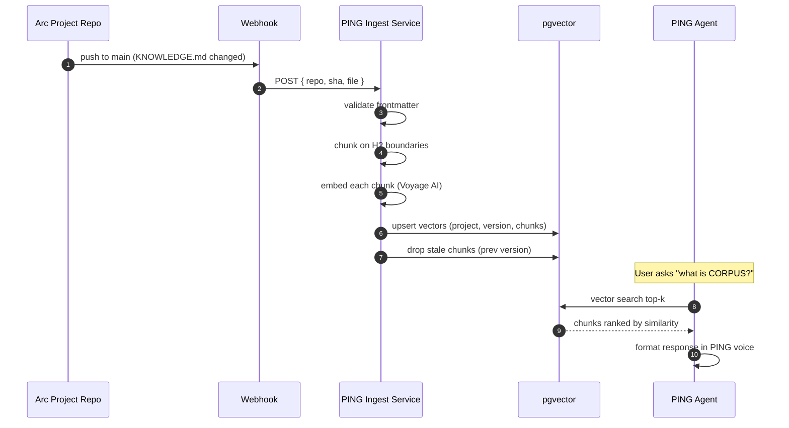

# `KNOWLEDGE.md` Schema Spec

**Status:** v0.1
**Owner:** PING team
**Companion:** [ping-prd.md §19](./ping-prd.md) (Knowledge Layer / RAG)

---

## 1 · Purpose

PING ingests a `KNOWLEDGE.md` file from every Arc project that wants to be queryable through PING's `learn.*` capabilities. This document defines the format every project must follow so retrieval works consistently.

If your project does not publish a `KNOWLEDGE.md`, your project will not appear in `learn.what_is(…)`, `learn.how_to(…)`, or `learn.compare(…)` results. You'll still execute as a capability — users just can't ask questions about you.

---

## 2 · File Contract

| Constraint | Value |
|---|---|
| **Filename** | `KNOWLEDGE.md` (exact, case-sensitive) |
| **Location** | Repository root |
| **Encoding** | UTF-8, LF line endings |
| **Max file size** | 50 KB raw / 20K tokens after tokenization |
| **Max chunk (H2) size** | 1K tokens |
| **One per project** | Cannot be split across multiple files |

Files exceeding limits are rejected at ingest time with a structured error pointing to the offending section.

---

## 3 · Frontmatter

Every `KNOWLEDGE.md` opens with YAML frontmatter between `---` delimiters.

### Required fields

```yaml
---
project: <slug>           # kebab-case, matches npm scope (e.g. "corpus", "float")
version: <semver>         # the doc version, not the package version
last_updated: <ISO date>  # YYYY-MM-DD
capabilities:             # list of capability names this doc explains
  - corpus.form
  - corpus.pay
---
```

### Optional fields

```yaml
description: <one-line>   # shown in PING's "learn what's available" listings
topics: [list]            # high-level concept tags for retrieval boost
tags: [list]              # fine-grained tags
homepage: <url>           # link returned in some `learn.*` responses
repo: <url>               # source repo (for "view source" tail)
maintainers: [emails]     # ignored by RAG; used for stale-doc nags
```

### Validation rules

- `project` must be unique across all registered KNOWLEDGE files
- `capabilities` must reference actual registered CapabilitySpec names — typos are rejected at ingest
- `version` increments any time the body materially changes (used for cache invalidation)
- `last_updated` ≥ 90 days old triggers a soft warning ("stale") in PING's admin dashboard

---

## 4 · Body Structure

After frontmatter, the body uses a fixed heading hierarchy:

| Heading | Role | Count |
|---|---|---|
| `# <project name>` | Title | Exactly 1 |
| `## <question or topic>` | Chunk boundary | Many |
| `### <subsection>` | Detail within a chunk | Optional |
| Lower headings | Not parsed for chunking | OK to use |

### H2 = chunk boundary

PING splits the body at every H2. Each H2 section becomes one RAG chunk:
- The H2 title is embedded alongside the body for retrieval
- Frontmatter `topics` and `tags` are inherited by every chunk
- Code blocks, lists, tables inside an H2 are kept together

### Writing H2 titles for retrieval

H2 titles should read like the user's question, not your internal taxonomy:

| ✅ Good | ❌ Bad |
|---|---|
| `## What is CORPUS?` | `## Overview` |
| `## How do I form an LLC?` | `## Formation API` |
| `## What does it cost?` | `## Pricing` |
| `## What's the difference between principal and mediator?` | `## Roles` |

The H2 is doing 80% of the retrieval work. Phrasing it as a literal user question dramatically improves hit quality.

### Body content rules

- Plain markdown only. No HTML.
- Code blocks: yes (preserved verbatim).
- Tables: yes.
- Lists: yes.
- Images: **no** — text-only RAG for v1.
- Math/LaTeX: avoid. Convert to inline prose or code.
- External links: keep relative to the source repo when possible.

---

## 5 · Voice

Your `KNOWLEDGE.md` answers will be **served verbatim** through PING (modulo light reformatting). They will be read by users in the PING voice. Match it:

- Terse over polite
- Direct over hedged
- Plain English over jargon
- Define unfamiliar terms inline, don't link out
- 1–3 sentences per answer where possible
- Skip the marketing copy

See [ping-brand.md](./ping-brand.md) §3 for the full voice spec.

---

## 6 · Worked Example

```markdown
---
project: corpus
version: 0.1.0
last_updated: 2026-05-19
description: Wyoming DAO LLC + ERC-8004 identity + USDC treasury for AI agents
capabilities:
  - corpus.form
  - corpus.pay
  - corpus.verify
  - corpus.state
  - corpus.is_name_taken
topics:
  - llc-formation
  - agent-identity
  - treasury
  - disputes
tags:
  - wyoming
  - erc-8004
  - usdc
  - dao-llc
homepage: https://corpus.xyz
repo: https://github.com/ronkenx9/corpus
---

# CORPUS

## What is CORPUS?
CORPUS gives an AI agent a legal body. One transaction deploys a Wyoming
DAO LLC manager contract, mints an ERC-8004 identity NFT, and delivers
both to the agent.

## What can a CORPUS entity do?
Hold USDC. Pay counterparties under a configurable spending policy.
Open and resolve disputes. Rotate operators. Get verified by anyone.

## How do I form a CORPUS entity?
Text PING "form llc 'My Agent LLC'" — PING creates it, the NFT lands
in your wallet, and the LLC contract is yours.

## What does it cost?
About 0.11 USDC in Arc gas. No protocol fee.

## Who's the principal and who's the mediator?
Principal is the agent that runs the LLC — signs payments, sets policy.
Mediator is the independent arbiter who resolves disputes. They must
be different addresses.

## How is a CORPUS entity verified?
PING checks `ownerOf(identityTokenId) == principal` on the ERC-8004
registry. If the NFT and the principal match, the LLC is legitimate.
```

This is a complete, valid `KNOWLEDGE.md`. Six chunks, ~600 tokens total, every H2 is a literal user question.

---

## 7 · Ingest Pipeline

What happens when a KNOWLEDGE.md changes:



### Ingest schedule

- **On commit**: webhook fires within ~10s of push to default branch
- **Nightly cron**: re-validates all KNOWLEDGE.md files at 04:00 UTC, catches misses
- **Manual**: `corpus-mcp` admin command `ping_reingest <project>` for ops

---

## 8 · Caching

- **Vector cache**: chunks live in pgvector indefinitely. Invalidated only when a new `version` arrives.
- **Answer cache**: RAG answers cache for 24h per `(question, project_version_hash)` pair. Identical questions don't re-LLM.
- **Soft refresh**: on `version` bump, the answer cache is partially evicted (only entries that referenced the changed chunks).

---

## 9 · What PING Does with KNOWLEDGE Files at Runtime

When a user asks a question, PING:

1. Detects the question via the routing fork (`?`, "what/how/why/can/does/is" prefix)
2. Vector-searches across all ingested chunks (top 5 by cosine similarity)
3. Filters by project if the user mentioned one ("what is CORPUS?")
4. Passes the top-k chunks + the user question to Claude Haiku 4.5
5. Returns a 1–3 sentence answer in the PING voice
6. Appends a *"want more?"* tail if there's relevant context PING didn't surface

Users never see chunk boundaries, project tags, or markdown formatting in the reply. The KNOWLEDGE file is source material, not output.

---

## 10 · Common Mistakes

| Mistake | Why it breaks | Fix |
|---|---|---|
| H2 titles are nouns ("Architecture") | Doesn't match user phrasing | Phrase as a literal question |
| Long H2 sections (3K+ tokens) | Chunk too big to embed cleanly | Split into multiple H2s |
| Marketing prose | Tone clashes with PING voice | Cut the adjectives |
| Capability list out of date | Ingest rejects unknown caps | Update `capabilities:` array on cap rename |
| Stale `last_updated` | Triggers ops warnings | Bump it on every meaningful edit |
| Linking out for definitions | Users can't follow links inside a text reply | Define inline, then link |
| Including images | RAG can't process them | Describe visually or use a code block |

---

## 11 · Adding a New Project

For Arc projects that want to plug into PING's `learn.*`:

1. Add `KNOWLEDGE.md` at repo root following this spec
2. Add `CapabilitySpec[]` export to your SDK (see [ping-prd.md §7](./ping-prd.md))
3. Open a PR against `ping/registry.json` adding your project:
   ```json
   { "project": "<slug>", "repo": "<url>", "sdk": "<npm package>" }
   ```
4. PING's ingest service picks it up within 10s of merge
5. Your capabilities and knowledge are live

That's it. The full integration loop is one config edit + one file + one SDK export.

---

**End of spec.**

> Treat your `KNOWLEDGE.md` like product copy, not documentation. A user is about to read it through a chat bubble. Write accordingly.
