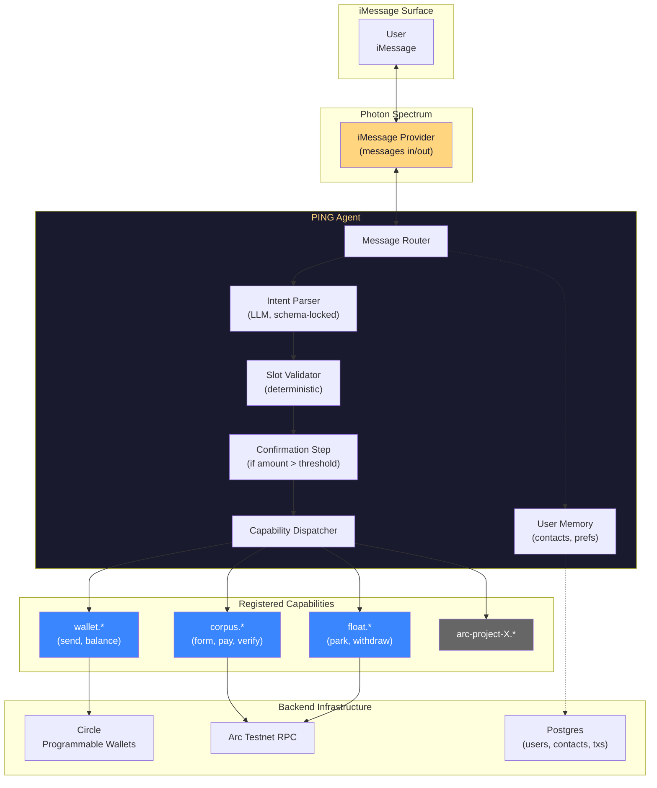

# PING — Product Requirements Document

**Status:** draft v0.2
**Owner:** @gadgetplug
**Target ship:** Arc Hackathon (10-day window)
**Repo:** TBD — likely sibling to `corpus/`
**Companion docs:**
- [ping-brand.md](./ping-brand.md) — voice, visual identity, copy
- [ping-knowledge-schema.md](./ping-knowledge-schema.md) — `KNOWLEDGE.md` spec for RAG ingestion
- [architecture.md](./architecture.md) — CORPUS architecture (one of PING's first capabilities)

---

## 1 · TL;DR

PING is a conversational agent that lives inside iMessage and lets users send USDC, hold yield, and operate Arc-native financial primitives by texting natural language. It is not a wallet app — it's a **distribution layer** that exposes any Arc project as a conversational capability, starting with our own (CORPUS, FLOAT). The thesis: Arc's $0.01 micro-transactions only make sense in a micro-interface, and a text message is the only UX cheap enough to match the rails.

---

## 2 · Problem

| | |
|---|---|
| **Today** | Every Arc project ships a web dashboard. Users must connect a wallet, switch networks, sign transactions in a browser. The friction is fixed regardless of transaction size — sending $2 costs the same UX overhead as sending $2,000. |
| **The miss** | Arc's sub-cent fees + sub-second finality enable micro-transactions, but no current interface makes micro feel native. Dashboards are over-engineered for $2 payments. |
| **PING's bet** | The cheapest interface in the world is one the user already opens 50× a day. iMessage. Push transactions into the existing conversation surface instead of forcing users into a new app. |

---

## 3 · Goals & Non-Goals

### Goals
- Ship a working iMessage agent in 10 days
- Onboard 50 real users in the hackathon window (traction = 30% of judging)
- Expose CORPUS + FLOAT + basic Arc primitives (send, balance, swap) through a single conversational surface
- Define a **CapabilitySpec** protocol that any Arc project can implement to plug into PING in <50 lines of code
- Process real value on Arc Testnet (not mocked)

### Non-Goals (v1)
- WhatsApp / Telegram support — iMessage only
- Custody beyond Circle Programmable Wallets — no self-custody flow
- Web dashboard for end users (admin dashboard for ops only)
- Fiat on-ramp — users fund via existing crypto rails
- Group chat awareness (single 1:1 conversation per user)
- Multi-language NLU — English only

---

## 4 · Users

### Primary
**The retail micro-transactor.** US-based, iMessage native, 18–40, comfortable with Venmo / Apple Pay Cash. Wants to send a friend money for coffee, split a dinner, or park idle cash in yield — without opening another app.

### Secondary
**The Arc project developer.** Has an Arc-native product (lending, perps, prediction markets) and wants distribution. Integrates with PING via CapabilitySpec to expose their primitives as conversational commands.

### Out of scope (v1)
- Power DeFi users (will rage at the lack of slippage controls, manual gas, etc.)
- Non-US users (iMessage penetration is low)
- Institutional flows

---

## 5 · Core Concepts

| Term | Definition |
|---|---|
| **Capability** | A single conversational verb the agent can perform (e.g. `pay`, `park`, `verify`). Implemented by an upstream Arc project. |
| **CapabilitySpec** | The interface contract a project implements to register with PING. |
| **Intent** | The parsed `(capability, slots)` tuple extracted from a user's natural-language message. |
| **Slot** | A typed parameter inside an intent — `amount`, `recipient`, `contact_name`, etc. Validated deterministically. |
| **Confirmation** | A reply formatter owned by each capability. Renders the post-execution response. |
| **Wallet** | A Circle Programmable Wallet, provisioned 1:1 with a user's iMessage identity, MPC-controlled, never seen by the user. |
| **Identity** | An iMessage user's resolved identity (Apple Account or phone number). Becomes the wallet key. |

---

## 6 · Architecture



---

## 7 · CapabilitySpec Protocol

The single most important deliverable in this PRD. Get this right and every Arc project becomes a 50-line PR. Get it wrong and every integration is a custom snowflake.

### TypeScript interface

```typescript
interface CapabilitySpec<Slots = Record<string, unknown>, Result = unknown> {
  /** Stable identifier, namespaced. e.g. "corpus.pay", "float.park" */
  name: string;

  /** Human description used by the intent parser. */
  description: string;

  /** Trigger phrases that bias intent parsing toward this capability. */
  triggers: string[];

  /** JSON Schema for required + optional slots. The parser fills these. */
  schema: {
    type: "object";
    properties: Record<string, JsonSchemaSlot>;
    required: string[];
  };

  /** Per-slot validators. Run deterministically before execution. */
  validators?: {
    [slot: string]: (value: unknown, ctx: UserContext) => Promise<void>;
  };

  /** True when amount/risk warrants an explicit "yes" confirmation. */
  requiresConfirmation?: (slots: Slots, ctx: UserContext) => boolean;

  /** The actual on-chain (or backend) call. */
  handler: (slots: Slots, ctx: UserContext) => Promise<Result>;

  /** Reply formatter. Returns the message PING sends back. */
  confirmation: (result: Result, slots: Slots) => string;

  /** Error → user-friendly explanation. */
  errorFormatter?: (err: unknown) => string;
}

interface UserContext {
  userId: string;            // PING-internal id (phone number hash)
  wallet: { address: Address; sign: (...) => Promise<Hex> };
  contacts: Record<string, Address>;  // resolved names → addresses
  prefs: Record<string, unknown>;     // yield prefs, risk tolerance, etc.
}

interface JsonSchemaSlot {
  type: "string" | "number" | "usdc" | "address" | "contact";
  description: string;
  examples?: string[];
}
```

### Example: `corpus.pay` capability

```typescript
const corpusPayCapability: CapabilitySpec = {
  name: "corpus.pay",
  description: "Pay USDC from a CORPUS LLC's treasury to a counterparty",
  triggers: ["pay from", "send from llc", "pay <manager>", "llc pay"],
  schema: {
    type: "object",
    properties: {
      manager: { type: "address", description: "CORPUS manager address" },
      counterparty: { type: "contact", description: "Recipient" },
      amount: { type: "usdc", description: "Amount in USDC", examples: ["10", "5.50"] },
      memo: { type: "string", description: "Optional memo" },
    },
    required: ["manager", "counterparty", "amount"],
  },
  validators: {
    amount: async (v, ctx) => {
      if ((v as bigint) <= 0n) throw new Error("amount must be positive");
    },
  },
  requiresConfirmation: (slots) => (slots.amount as bigint) > 50_000_000n, // > $50
  handler: async (slots, ctx) => {
    return corpusClient.pay(slots.manager, slots.counterparty, slots.amount, slots.memo ?? "");
  },
  confirmation: (r, s) =>
    `✓ Sent $${fmtUsdc(s.amount as bigint)} USDC from your LLC to ${s.counterparty}\n` +
    `  tx: ${r.txHash.slice(0, 10)}…`,
};
```

### Registration

Capabilities register at agent boot. The dispatcher builds an index:
- `triggers` → for fast pre-LLM routing
- `schema` → for the LLM intent parser
- `name` → for execution lookup

A new Arc project ships a `CapabilitySpec[]` export. PING imports it. Done.

---

## 8 · Functional Requirements

### F1 — First-contact onboarding
**When** a new iMessage user sends *any* message to PING for the first time
**Then** PING auto-provisions a Circle Programmable Wallet, stores `iMessageIdentity → walletAddress`, and replies:
```
Hey 👋 I'm PING — your Arc wallet, in iMessage.

Your wallet is ready:
0x7a64…8BcEb

Try:
  • "balance"
  • "send Alice $5"
  • "park $10"
```

### F2 — Wallet operations
- `balance` → reply with USDC balance (formatted)
- `send <name> $<amount>` → resolves name from contacts, executes USDC transfer, confirms
- `swap $<amount> to <token>` → (stretch goal) executes swap via Arc AppKit
- `fund` → returns the user's wallet address as a QR code + plain text for deposits

### F3 — FLOAT integration
- `park $<amount>` / `save $<amount>` → moves USDC into FLOAT yield product
- `withdraw $<amount>` → exits position
- `yield` → shows current APY + accumulated earnings

### F4 — CORPUS integration
- `form llc "<name>"` → creates a CORPUS entity
- `llc state` → reads entity state
- `llc verify` → cryptographic NFT-owner check
- `llc pay <name> $<amount>` → pays counterparty from LLC treasury

### F5 — Memory
- After 3 sends to the same recipient, PING auto-saves them as a contact
- `contacts` → lists saved contacts
- `the usual to <name>` → reuses the last transaction amount with that contact

### F6 — Confirmation flow
- **All transfers require an explicit confirm in v1.** Confirm-by-default trades a small UX tax for a much larger trust gain while users learn what the agent does.
- Low-risk confirms render as a one-line summary + Confirm/Cancel; the user replies "yes" / "no" / taps a button.
- High-risk confirms (>$100, new recipient, first time sending from an LLC treasury) render as a full card with from/to/network/fee/arrival.
- Future opt-out: a user can text `confirm off` to skip confirms below a threshold. Off by default in v1.

### F7 — Error handling
- All capability errors map to a user-friendly explanation
- Failed transactions retry up to 1× on network errors
- Unknown commands → `Sorry, I didn't get that. Try "help" to see what I can do.`

### F8 — Help & discovery
- `help` → lists all registered capabilities, grouped by namespace
- `help <capability>` → schema + examples for that capability

---

## 9 · User Flows

### Flow A — First-message onboarding

```
[User adds PING contact, sends "hi"]

PING: Hey 👋 I'm PING — your Arc wallet, in iMessage.

      Your wallet is ready:
      0x7a64…8BcEb

      Try:
        • "balance"
        • "send Alice $5"
        • "park $10"

      Tap below to fund with $5 to get started.
      [💰 Get $5 from PING] ← optional faucet hook
```

### Flow B — Send

```
User: send tunde $20
PING: ✓ Sent $20 USDC to Tunde.
      Arc confirmed in 0.4s.
      Balance: $143.20
```

### Flow C — Send (large, with confirmation)

```
User: send sarah $200
PING: Confirm: send $200 USDC to Sarah?
      Reply "yes" to proceed, "no" to cancel.
User: yes
PING: ✓ Sent $200 USDC to Sarah.
      Balance: $43.20
```

### Flow D — FLOAT park + yield notification

```
User: park $50
PING: ✓ $50 USDC earning 4.2% APY in USYC.
      I'll let you know when it grows.

[24h later, async push]
PING: 💰 Your yield earned $0.06 overnight.
      Total: $50.06 in FLOAT.
```

### Flow E — CORPUS LLC operations

```
User: form llc "Coffee Trader LLC"
PING: ✓ LLC formed.
      Manager: 0x8712…5c87
      Identity NFT #15840 delivered to your wallet.

      Try: "llc pay alice $10" to use the LLC treasury.
```

### Flow F — Help

```
User: help
PING: I can do these things:

      💸 wallet
        send, balance, swap, fund

      📈 yield (FLOAT)
        park, withdraw, yield

      🏛 LLC (CORPUS)
        form llc, llc state, llc verify, llc pay

      Type "help <command>" for examples.
```

---

## 10 · Intent Parsing

This is the technical bet. Get it wrong, money moves to the wrong recipient.

### Design rules
1. **LLM never picks amounts or addresses directly.** It only fills slots into a known schema.
2. **Slot validation is deterministic.** Type checks, balance checks, allowlist checks happen outside the LLM.
3. **Ambiguous inputs trigger a clarification, not a guess.**
4. **Fast-path the obvious cases.** Strict regex matches (`send (\w+) \$(\d+(\.\d+)?)`) execute without an LLM call.

### Pipeline

```
1. Raw message arrives
2. Try fast-path regex match → if matched, fill slots, skip LLM
3. Otherwise, call LLM with:
     - System prompt: "You are an intent parser. Given a message, return JSON
       matching one of these capability schemas..."
     - Tools: capability schemas as function definitions
   LLM returns: { capability, slots, confidence }
4. If confidence < 0.8 → ask clarifying question, do not execute
5. Resolve contact names → addresses via user.contacts
6. Run validators on every slot
7. If requiresConfirmation(slots) → send confirmation, await yes/no
8. Execute capability.handler(slots, ctx)
9. Send capability.confirmation(result, slots)
```

### LLM choice
- **Claude Haiku 4.5** or **GPT-5 nano** — both cheap (~$0.001/parse), low-latency (<500ms), strong at structured output
- Tool-use mode (forced JSON), not free-form text
- 100ms parse target

### Confidence threshold
- ≥ 0.95 → execute directly (small amounts only)
- 0.80–0.95 → execute with implicit confirmation in reply ("OK, sending $X to Y…")
- < 0.80 → explicit clarification ("Did you mean: A, B, or C?")

---

## 11 · Trust & Safety

| Concern | Mitigation |
|---|---|
| **Wrong recipient** | All sends > $50 require explicit "yes" confirmation. All new recipients (not in contacts) require confirmation regardless of amount. |
| **Wrong amount** | Slot validator caps individual sends at $500 in v1. Daily cap of $1,000. Both per-user. |
| **Replay attacks via iMessage spoofing** | Photon Spectrum validates iMessage identity at the platform level. Each user maps to an Apple Account, not a phone number alone. |
| **Wallet compromise** | Circle Programmable Wallets are MPC. PING server holds one share, Circle holds another. Theft requires breaching both. |
| **Custody framing for judges/regulators** | One-sentence answer: "PING is a non-custodial frontend. Wallets are user-owned via Circle's MPC infrastructure. We never have unilateral control of funds." |
| **LLM hallucinates a capability** | The dispatcher only routes to *registered* capabilities. If the LLM returns an unknown `name`, the dispatcher rejects it before any code runs. |
| **Rate limit / spam** | 10 messages/minute per user. Exponential backoff on repeated failures. |

---

## 12 · Hackathon Scope (10 days)

### Definition of done
- ✅ iMessage agent live, talking to real users
- ✅ Wallet provisioning on first message
- ✅ `send`, `balance`, `park`, `withdraw`, `help` working
- ✅ One CORPUS capability integrated (`llc verify` at minimum)
- ✅ CapabilitySpec published as an importable npm package
- ✅ 20+ real users have completed at least one transaction
- ✅ Demo video shot on a real phone, real conversation, real money on Arc Testnet

### Day-by-day

| Day | Build | Outcome |
|---|---|---|
| 1 | Photon Spectrum + iMessage provider setup. Echo test working. | Round-trip message in → message out. |
| 2 | Circle Programmable Wallet provisioning. Postgres schema for users/contacts/txs. | First-message onboarding flow live. |
| 3 | CapabilitySpec protocol implemented. `wallet.send`, `wallet.balance` as first two capabilities. | `send <name> $X` works end-to-end. |
| 4 | Intent parser (regex fast-path + LLM fallback). Slot validation. | Natural-language sends working. |
| 5 | FLOAT integration as a capability. `park`, `withdraw`, `yield`. | Yield commands live. |
| 6 | CORPUS integration as a capability. At least `corpus.verify` + `corpus.form`. | LLC commands live. |
| 7 | Confirmation flow for large amounts. Contact memory. Error handling polish. | Production-feel UX. |
| 8 | Admin dashboard for live tx volume (judges' view). Onboard 10 real users. | Traction story starts. |
| 9 | Push traction to 20+ users. Capture demo video. | Demo asset locked. |
| 10 | Pitch deck. Submission. | Ship. |

### Cut lines (if behind schedule)
- Drop `swap` capability (Arc AppKit integration is heaviest)
- Drop CORPUS form (keep only `verify`)
- Drop async yield-earned notifications (poll-on-request instead of push)

---

## 13 · Success Metrics

### Hackathon
| Metric | Target |
|---|---|
| Real users onboarded | ≥ 20 |
| Transactions executed | ≥ 50 |
| Unique capabilities used | ≥ 4 |
| Wallet-to-wallet transfers in demo | ≥ 1 with a real human counterparty |
| Demo video completes without script errors | Yes |

### Post-hackathon (30 days)
| Metric | Target |
|---|---|
| Daily active users | ≥ 100 |
| Capability integrations (other Arc projects) | ≥ 3 |
| Capability registry as installable package | published |
| Median message → reply latency | < 2s |

---

## 14 · Risks

| Risk | Likelihood | Impact | Mitigation |
|---|---|---|---|
| Photon iMessage provider has unexpected limits | Low (team has shipped on Photon before) | High | Confirm in Day 1 echo test. Have Telegram fallback path documented. |
| Intent parser fails on edge cases mid-demo | Medium | High | Demo uses fast-path regex commands; LLM fallback is for traction-period real users, not the live demo. |
| Circle Programmable Wallets have rate limits | Low | Medium | Pre-provision wallets for known testers ahead of demo day. |
| Arc Testnet downtime during demo | Low | High | Record a backup demo video the day before. |
| LLM cost spikes with traction | Low at hackathon scale | Low | Cap per-user requests. Cache repeated parses. |
| Judges ask custody / regulatory question | Certain | Medium | One-sentence answer prepared (see §11). |

---

## 15 · Open Questions

1. **Integration shape** — ~~do upstream Arc projects ship a TypeScript SDK PING imports (monorepo / single-host model) or expose a network protocol PING calls (MCP-style, multi-host)?~~ **🔒 LOCKED v1: imports.** PING imports `@corpus/sdk` and `@float/sdk` directly. Each project exports its `CapabilitySpec[]` as part of its public package. This keeps integration latency at ~0ms and removes a deployment dependency. **v2 plan:** expose a network protocol (likely MCP-over-HTTP) so external Arc projects can register without forking PING's repo.

2. **Identity primitive** — Apple Account vs phone number vs email. Apple Account is the cleanest from Photon's side, but phone number is the most portable for cross-platform v2. **Recommendation:** Apple Account internally; show phone number to the user; reserve phone-number routing for v2.

3. **Capability monetization** — does PING take a basis-point fee on capability execution? Free at hackathon. Post-hackathon question.

4. **Group conversations** — out of scope for v1. But the spec should not preclude it. Need to confirm `CapabilitySpec.handler` can be called with a `groupContext` in future versions.

5. **Pricing for wallet operations** — Arc gas is paid by the user's wallet. Confirm Circle Programmable Wallets handle native-USDC gas correctly on Arc.

6. **Demo recipient** — for the showcase video, you need a real person to receive a transfer in iMessage. Who is the planted counterparty?

---

## 16 · Glossary of Connected Projects

| Project | Role in PING | Status |
|---|---|---|
| **CORPUS** | LLC formation + treasury capability | ✅ live on Arc Testnet, factory `0x7A641f…8BcEb` |
| **FLOAT** | Yield capability (USYC) | TBD — referenced as built; needs SDK surface |
| **Circle Programmable Wallets** | User custody | API integration required |
| **Photon Spectrum** | iMessage transport | SDK 1.6 referenced; auth setup required |
| **Arc AppKit** | Swap primitive (stretch goal) | Not integrated |

---

---

## 17 · Voice & Personality

PING is not a chatbot. It's a competent friend who happens to know about money. The voice is consistent across every reply, every capability, every error message — the same voice talks about $5 transfers and forming LLCs.

### Voice rules
- **Terse over polite.** "Sent." beats "Your transaction has been successfully processed."
- **Direct over hedged.** "That'll fail — you only have $4." beats "I noticed there might be an issue…"
- **Action-oriented over status-oriented.** "Balance: $43.20" beats "Your current balance is $43.20."
- **Dry over chirpy.** Skip "Sure!", "Absolutely!", "Happy to help!"
- **Confident over apologetic.** No "I'm just an AI…" or "I apologize for the inconvenience."

### Forbidden patterns
- Greetings that take up space ("Hi there! How can I help you today?")
- Emoji as substitute for words (✨ "All done!" ✨)
- Restating the user's question back at them
- Hedge phrases: "I think", "perhaps", "you might want to"
- Corporate filler: "Please be advised", "We've initiated"
- Self-reference unless asked ("PING here!" → no)

### Allowed patterns
- One emoji per message max, only when it adds information (✓ ✗ 💰 ⚠)
- Dry humor in errors: *"$200 to Tunde? You don't have $200, friend."*
- Brief explanation when the user asks why: *"USYC is short-term Treasury yield. ~4% APY, USDC-redeemable."*
- Calling out user mistakes without softening: *"Wrong address — the one you typed isn't valid."*

### Style examples

**Wallet provisioned:**
```
✓ Wallet ready: 0x7a64…8BcEb
   Send me USDC to start, or ask me anything.
```
*(Not "Welcome! I'm PING, your friendly Arc assistant!…")*

**Send (canonical, with confirm):**
```
User: send Tunde $5 for coffee
PING:  Sending 5 USDC to Tunde on Arc.
       Fee: $0.01   Arrival: under 1 sec.
       Confirm?
User: yes
PING:  Done.
```

**Send fails — insufficient balance:**
```
You only have $4.30 — that send needs $20.
Fund your wallet first.
```

**Out of scope:**
```
Not yet. I do wallet stuff, yield (FLOAT), and LLC ops (CORPUS).
Type "help" for what's wired up.
```

**Yield earned (async push):**
```
+$0.06 overnight. Total: $50.06 in FLOAT.
```

### Consistency enforcement
Every capability's `confirmation` formatter is reviewed against this spec before merge. The voice is a deliverable, not a vibe.

---

## 18 · Abuse Prevention & Cost Defense

API credits are the single largest variable cost. Defense is layered: cheap layers fire first, expensive ones only when needed.

### Per-user limits
| Limit | Value | Rationale |
|---|---|---|
| Hard rate limit | 10 messages/minute | Anti-spam |
| Soft rate limit | 100 messages/day | Bounds a real power user |
| LLM token budget | 5,000 tokens/day | ~$0.005/user/day cap |
| Consecutive parse failures | 3 → 30s cooldown | Breaks loops |
| In-flight intents | 1 max | Forces resolution before next action |

### Cost circuit breakers
- **Global hourly LLM spend cap.** If exceeded, the agent falls back to regex-only parsing. Replies become: *"I can only do exact commands right now — try `balance`, `send <name> $X`, `help`."*
- **Per-user spend monitoring.** Any user exceeding $0.10/day in LLM cost flags for human review. Not blocked, watched.

### Smart caching
- Common queries (`balance`, `help`, `recent`) bypass the LLM via regex fast-path. Target: 60%+ of all messages.
- RAG responses cache 24h. *"What is FLOAT?"* asked twice = one parse.
- Identical messages from the same user within 60s collapse to one execution.

### Behavioral fingerprinting
- Track inter-message timing distribution. Human typing has natural jitter; bots don't.
- Photon may expose typing-pattern signals (length variance, response delay). Use when available.
- Bot-pattern matches flag for review, never auto-block — false positives lose users.

### Capability gating for new users
First 24 hours after onboarding: access to `balance`, `help`, `learn.*`, and `send` capped at $5. After 24h **and** at least one inbound deposit, the full capability set unlocks. Bounds spam-account damage to $5 max.

### Sanctions screening
Every outbound recipient address gets an OFAC SDN check before signing (cached, ~5ms). Match → refused with: *"Can't send to that address. It's on a sanctioned list."*

---

## 19 · Knowledge Layer (RAG)

A bot that can answer *"what is FLOAT?"* earns two things at once: educated users **and** dramatically lower LLM costs. Every info-question that bypasses the financial-intent parser is functionally free.

### Capability namespace
- `learn.what_is(topic)` — definitional
- `learn.how_to(action)` — procedural
- `learn.compare(a, b)` — comparative
- `learn.fees()` — fee schedule
- All routed via the `learn.*` namespace as part of CapabilitySpec.

### Routing fork
The intent parser has a top-level fork:
1. **Question** — ends with `?`, starts with `what/how/why/can/does/is` → route to RAG
2. **Command** — imperative → route to financial-intent parser
3. **Ambiguous** → default to RAG with a *"want me to do this instead?"* tail

### Knowledge sources
Every Arc project owned by us publishes a `KNOWLEDGE.md` at repo root. PING ingests on schedule (daily + on commit webhook). Sources for v1:
- **CORPUS** — `README.md`, `docs/architecture.md`, this PRD, glossary
- **FLOAT** — `README.md`, fee schedule, mechanism doc
- **PING** — this PRD, user guide
- **Arc protocol** — public docs (sub-cent fees, USDC-gas, finality)

Out of scope for v1: Wikipedia, broader DeFi explainers. Knowledge stays scoped to "stuff PING can actually do."

### Stack
| Layer | Choice | Why |
|---|---|---|
| Storage | pgvector in existing Postgres | No new infra |
| Embeddings | Voyage AI `voyage-3-lite`, fallback OpenAI `text-embedding-3-small` | Cheap, fast, retrieval-quality |
| Generation | Same Claude Haiku 4.5 as intent parser | Voice consistency |
| Refresh | Nightly cron + commit webhook on `KNOWLEDGE.md` | Stays current |

### Response format
RAG answers obey the voice spec (§17): terse, direct, no fluff. Soft cap 3 sentences. Tail with *"want more?"* for opt-in expansion.

**Example:**
```
User: what is float?
PING: FLOAT parks idle USDC in short-term Treasury yield (USYC).
      ~4% APY, withdraw anytime, no lockup.
      Want to try? "park $10".
```

### Self-help loop
The same RAG handles *"I'm confused"* / *"what went wrong"* / *"explain that"*. A stuck user always has a natural-language escape hatch — no support tickets, no docs to dig through.

---

## 20 · Additional UX Requirements

Beyond the three big additions above, four more I'd argue belong in v1:

### 20.1 · The first-week experience
Onboarding doesn't end at wallet creation. The 7-day arc defines retention:
- **Day 0** — wallet provision + *"send $5 to try"* hook
- **Day 0–1** — first send completed (the **magic moment**)
- **Day 2** — async nudge if no second tx: *"You haven't sent anything since Sunday. Try `park $5` to earn yield while you decide."*
- **Day 3–5** — contact memory: *"Tunde isn't saved yet — want me to remember?"*
- **Day 7** — first weekly recap: *"This week: 3 sends, $0.42 earned in FLOAT. Quiet week."*

Each touchpoint is one message. Never a tutorial wall.

### 20.2 · Failure UX templates
Every error mode gets a template — never a stack trace, never silence:

| Failure | Reply |
|---|---|
| Insufficient balance | `You only have $X — that send needs $Y. Fund your wallet first.` |
| Unknown recipient name | `I don't know "Tunde" yet. Reply with their address or "save tunde 0x…" first.` |
| Tx reverted on-chain | `That send failed on Arc. Reason: <decoded>. Tx: <link>. Try again or text "help".` |
| Network timeout | `Arc didn't respond. Already submitted — checking again in 30s.` |
| Parse ambiguous | `Did you mean: send $20 to Tunde, or park $20? Reply 1 or 2.` |
| Rate limit hit | `Slow down — 10 messages in the last minute. Wait 30s.` |

### 20.3 · Notification preferences
In iMessage, every async reply IS a notification. Without user control, our own yield-update messages become spam from us.
- **Default**: notify on inbound USDC. Suppress yield updates.
- `notifications on/off` — toggles all async
- `notify yield` / `notify silent` — granular
- All async sends respect quiet hours (default 10pm–8am user-local, inferred from Apple region).

### 20.4 · Transaction history
- `recent` → last 5 transactions, formatted with Arcscan links
- `recent 20` → last 20
- Cheap to build, high trust value. v1.

---

**End of document.**

> Next step: lock the CapabilitySpec interface (§7) and stub out the first three capabilities (`wallet.send`, `wallet.balance`, `corpus.verify`) before touching iMessage transport. The protocol is the moat. **Voice spec (§17) gets reviewed alongside every capability merge** — voice consistency is a deliverable.
